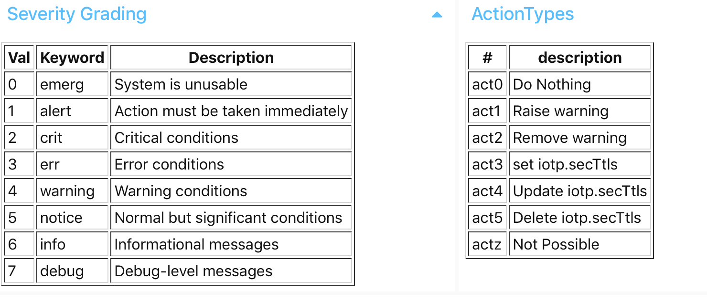
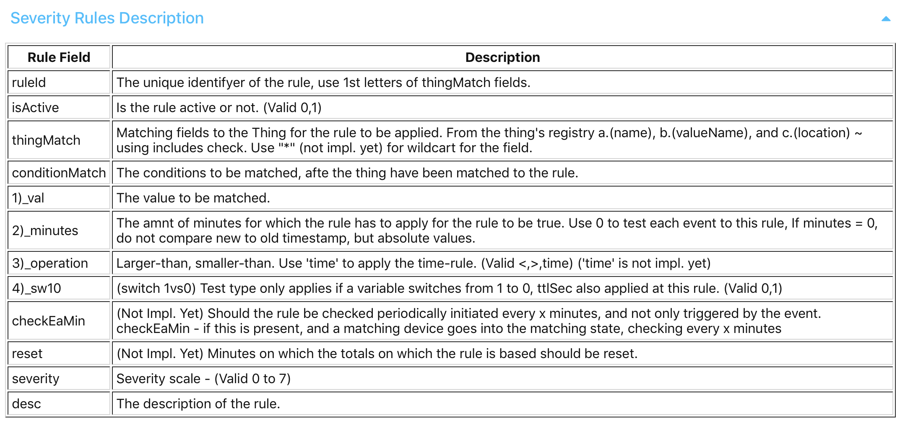

# iotp_dig2

A framework which creates a 'digital twin' representation of a home, and reduces the complexities of running the full solution.

## A. Why, Used for what, and Inspiration

### A1. Why this Approach

Why **YAIOTF ?** (Yet another IoT Framework?). What problems did I have that I wanted to solve? What else were our options? Well, after running automation of a home for three years, which also ran on Node-RED, with ESP8266's and MQTT, with a front-end on Node-RED Dashboard, maintaining the systems became more complex. Several friends asked for systems as well. After the initial 2 yrs of having stats about our home at our fingertips, the wow-factor wore off, and only the value-adds remained. We also realised that voice commands, or a message-based interface where one can subscribe to only those messages that suites us, is useful. We also realised that to maintain an IoT system, using Node-RED, means that if you do fault-finding with different configurations will take a lot of time.

We then started looking at what was commercially available, not only for Home Automation, but since we were involved in other IoT solutions, were looking for what others did to solve similar. In the home automation space, we could have gone with pre-built apps only, like `Apple's HomeKit`, `Home Assistant`, Google Home, and others. We liked the flexibility of Node-RED, and saw that there is place to use both, own config, with for instance HomeKit. We like the Home Assistant way to configure new services, the standard of Homie for discovery. We also looked at the following:

  1. Amazon Web Services IoT Framework.  
  2. SAP's Leonardo IoT framework.
  3. Efforts by different parties to standardize, like Homie.
  4. The inner workings of MQTT, specially the retained flag.

### A2. Framework Needs

After looking at the above, specially the `Shadow` tooling and `Registry` in AWS IoT Framework, on how it used MQTT topics to delineate and keep state, we got inspired.... Broadly, our requirements list were then drawn up:

<details>
    <summary>Expand for the Needs we built the Framework on.</summary>

|#| Requirement Description |Req. Name|  
|-|-------------------------|-------------------  
|1|A framework, that created definition of the IoT devices, only in one place. |Registry |
|2|A capability where the complexity of receiving, sending, and managing the underlying IoT devices is hidden from the rest of the framework. |Broker |
|3|Standardized messaging symantics, where messages in the framework, and to other building blocks are standardised, to reduce maintenance. | The iotp message protocol |
|4| Retention of the latest-, and previous state of devices, to determine for instance durations between changes in state, thus the 'Digital Twin' of the Devices. | Twin Shadow |
|5| A rules engine, that can watch the states of devices, and take actions based on a severity of the state | Twin Rules Engine |
|6|The ability to plug in other solutions, (which can run in its own space, which will reduce maintenance), only communicating to the rest through mqtt messages, to provide new functionality, without needing to know the underlying protocols of talking to the IoT devices.  |Docker containers talking to 'The Broker'|
|7|A Plug-in to enable Apple HomeKit, where The Broker talks in the Apple HomeKit json format to it, and it talks back to the Broker - and not with the Devices  |HomeKit Node-RED Docker container|

Other solutions can now be 'plugged-in' as well, we are working on a `Messenger` container.

</details>

## B. Architecture & Building Blocks

See the architecture below:


### B1. Building Block functions of iotp_dig2

<details>
    <summary>Expand for the The iotp_dig2 function Building blocks. </summary>

```
1. Application Settings:   
   a. Registry
   b. Rules. (Severity, Action settings)
   c. Config settings

2. In-Memory Settings Lists
   a. Things Registry
   b. Things Shadow  
   c. Others

3. Broker:
   a. to dig2, from controllers (Using the `dig2 iotp` protocol):
      i. Shelly
     ii. espeasy
   b. to controllers, from:
      i. HomeKit
     ii. dig2Msgr (not impl.)
   c. to HomeKit, from dig2 (Using the digsHomeKit protocol):
   d. to CoachDB, from dig2

4. Events Engine:
   a. Prime the Lists:
      i. Registry & Shadow lists
     ii. Display list
   b. Maintain in-memory lists (prune)
   c. On Event arrival:
      i. Update Shadow on Events
     ii. Update Thing events list
   d. Thing inter-Event calculations (DEPRECATED)

5. Rules Engine:
   a. Define Rules (yaml)
   b. Apply rule to event
   c. Update Shadow
   d. Make actions available to other platforms

6. Web Admin Interface:
   a. Things Registry & Controllers
   b. Things Shadow
   c. Things Status. Events, Totals  
   d. Setup.
      i. Severity Grading
     ii. Action Types
    iii. Severity Mapping Rules

7. Testbed. Trigger test events.
```
</details>

### B2. Building Block Examples

#### 1.a. Registry in YAML example

```
- regId:      Irr-1
  name:       Irrigation
  valueName:  Leg 1
  loc:        Garden
  NSEW:       S
  ReadOnly:   false
  IsDepl:     1
  Controller: ESP62
  type:       Switch
  Sensor:     Relay
  CntrDef:
    TaskNo: 5
    GPIO:   15
  mqtt_topics:
    to:     "/ESP62/cmd"
    from:   "espeasy/ESP62/Switch/Relay1"
  valType:
    "0" : Off
    "1" : On
  HomeKit:
    service: Valve
    val:     Active
  comments:   "-"
```

Or, the `ValType json` object version:
<details>
    <summary>Click to expand!</summary>


```
    - regId:      Gat-2
      name:       Gate
      valueName:  DoorState
      loc:        Outside
      NSEW:       SW
      ReadOnly:   false
      IsDepl:     1
      Controller: ESP66
      type:       Switch
      Sensor:     Relay
      CntrDef:
        TaskNo: "?"
        GPIO:   "?"
      mqtt_topics:
        to:   "/ESP66/cmd"
        from: "espeasy/ESP66/DoorState"
      valType:
        TargetDoorState:
          "0" : Open
          "1" : Closed
        CurrentDoorState:
          "0" : Open
          "1" : Closed
          "2" : Opening
          "3" : Closing
          "4" : Stopped
      HomeKit:
        service: GarageDoorOpener
        val:     TargetDoorState
      comments:
```

</details>

#### 1.b. Rules Severity classes, and Settings

<details>
    <summary>Expand for the Severity & Action Types. </summary>



</details>

#### 3.a. The dig2.iotp Protocol

<details>
    <summary>Expand for the dig2.iotp Protocol</summary>

All events from the Controllers & Devices are translated to the **'dig2 iotp Protocol'**, which looks as follows:   

```
{"regId": regId, "timestamp": jstime, "val": val}
```
  - The `regId` json key is the key with which other values can be looked up in the `Registry`.  
  - Value - `val` - in it's **simplest** form:   

  - The json key `val` is the value which then corresponds to the `valType`'s in the `Registry`, for instance:   
    0 - Off   
    1 - On
  - It represents the simplest feedback a device can give, like temperature value, or open / close status, etc.   

- Value - `val` in it's **json object** form, it looks like this:
```
{"regId": regId, "val":
{ValTypeClass1:{"0":"open","1":"closed"},
ValTypeClass2:{"0":"something1","1":"something2"}}, "timestamp": jstime}   
```   
  - This is used if one device needs to send back more than one value, like `{CurrentDoorState, TargetDoorState}`.   
  - The **'dig2 iotp Protocol'** would then look like the following:  

</details>

#### 3.c. The dig2.HomeKit Protocol

<details>
    <summary>Expand for the dig2.HomeKit protocol. </summary>

In order to standardise the messages going to the Node-RED HomeKit instance, a standard `from dig2` to `dig2 HomeKit` is required:

```
{"topic"   : 'iotpHomeKit/' + HomeKit.service + '/' + regId,
 "payload" : {"val": val} }
```
or, as per above **'dig2 iotp Protocol'**, the payload can be in the **json object** form.

</details>

#### The Rules Engine  

##### 5.a. Rules in YAML example

<details>
    <summary>Expand for the dig2.Rules Engine</summary>

Find below an example of a rule in yaml, a list of rules as example, and the meaning of the columns of the rules defined in yaml.


###### yaml rule

```
- ruleId: ahq01
  desc: "val < 3% humidity in Quad for longer than 12hrs"
  # Could mean that the sensor is broken
  isActive: 0
  thingMatch:
    name:       Air
    valueName:  Humidity
    loc:        Quad
  conditionMatch:
    val: 3
    minutes: 6 # change back to 720
    operation: "<"
  severity: 3
```

###### Example of Type of Severity Mapping Rules possible (above is row 1):


Meaning of Columns with which to define a severity rule:



</details>


## C. Installation Advise

<details>
    <summary>Expand for installation advice</summary>

### C1. Docker Containers of iotp_dig2  

|#| Container Name|docker?| Ver    | Some Details
|-|---------------|-------|--------|--------------
|a|iotp_dig2      |y      | v0.0.6 |Required, 'almost' a generic framework. The registry, broker, shadow, rules engine.
|b|iotp_dig2Msgr  |y      | v0.0.1 |A subscribe-based messenger and bot with which to interact with the IoT shadow.
|c|iotp_coachdb   |y      | -      | a No-SQL db underlying the events, if history of the events are required for further analysis.
|d|iotp_HomeKit   |y      | v0.0.7 |Less of a framework to run Apple's HomeKit.
|e|iotp_mqtt      |y      | v1.0.0 |A broker.
|f|menu_ansible   |not yet| v0.0.5 |A menu system with which to drive Ansible, which which the management of the system is done.

### C2. Node-RED flows
|#| Node-RED Flows required |In Container|
|-|-------------------------|------------|
|1|node-red-dashboard       |a|

### C3. Installation Pre-Requisites

|#|Pre-Req | Containers|a|b|c|d|e|
|-|--------|-----------|-|-|-|-|-|
|1|Ansible |           |y|y|y|y|y|
|2|Docker  |           |y|y|y|y|y|
|3|github  |           |y|y|y|y|y|
|4|Node-RED|           |y|y|n|y|y|
|5|Telegram|           |n|y|n|n|n|  

</details>

## D. Deeper Understanding


### D1. Instructions for Pub-Sub between dig2 Services.

<details>
    <summary>Expand for examples of Pub-Sub services</summary>


|# | From            | To              |Example mqtt Topic            |Data Payload Ex.    | Description          |
|--|---------------- |-----------------|------------------------------|--------------------|----------------------|
|1a|Device - Light   |iotp_dig2.Broker |espeasy/ESP70/Light/Switch    |"1"                 |Info from device      |
|1b|Device - Gate    |iotp_dig2.Broker |espeasy/ESP66/CurrentDoorState|"1"                 |   "                  |
|2a|iotp_dig2.Broker |Device - Light   |/ESP70/gpio/12                |"1"                 |Instructions to Device|
|2b|iotp_dig2.Broker |Device - Gate    |/ESP66/cmd                    |"TargetDoorState_0" |   "                  |
|||||||
|3 |iotp_dig2.Broker |iotp_dig2.Twin   |Internal flow to flow|{"regId": "Irr-1", "val": val, "timestamp": jstime}||
|4 |iotp_dig2.Twin   |iotp_HomeKit     |iotpHomeKit/LightBulb/Lig-1   |{"On":1}            |  |
|5 |iotp_HomeKit     |iotp_dig2.Broker |iotpHomeKit/command/Irr-1     |{event:"L1"}        |then back to 2a, b.  |
|||||||
|6 |iotp_dig2.Twin   |iotp_dig2Msgr    |Still to be done.|||


</details>

### D2. Advise for Edge Processing
To be completed. Here we add how to setup in ESPEasy & others for dig2 to work.

<details>
    <summary>Expand for the assitance on configuring ESPEasy Rules, others.</summary>

#### ESPEasy:
  - To add time to the json object, use **%unixtime%**, remember to x 1000 when the value comes in, to be a JS timestamp object.
  - For instance, to pubish to mqtt from ESP Rules:   

    ```
    Publish iotpDig2,{regId:"Gat-1",
                      val:{CurrentDoorState:1},
                      timestamp:%unixtime%}
    ```

#### Other?

</details>

## E. Maintenance Status

### E1. Maintainer
Jéan Roux, <jean@iotplay.org>. Find a Trello board with the dev pipeline. [Trello IoTP dig2 Invite](https://trello.com/invite/b/yC1CnUMK/f45c720766ca0d44e7c28e3c00375494/iotp-dig2).

### E2. Big-ticket items & Outstanding for Next releases
1. Self-Discovery of Devices & Things.
  We will use the Homie mqtt self-discovery standard. [Homie - An MQTT Convention for IoT/M2M](https://homieiot.github.io).

2. **dig2Msgr** using Telegram not completed yet.

3. **Rules Engine** not completed yet.

4. **Registry yaml** - in HomeKit - the `service` must be an array of required services, not just one service.

5. Make it **Multi Client** so that the same framework can be hosted centrally for different clients?
