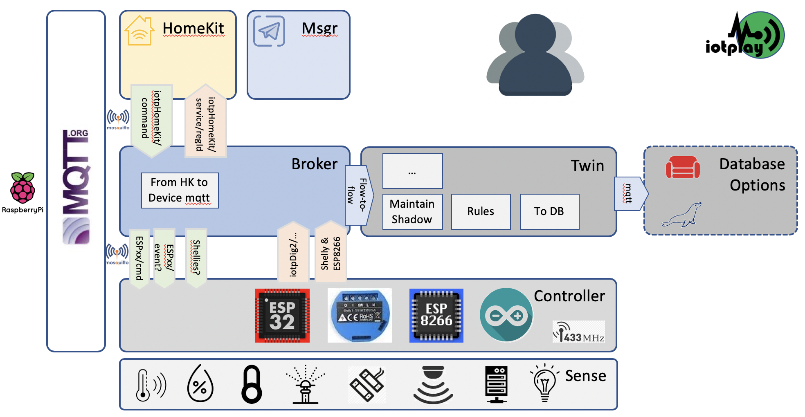

# iotp_dig2

A digital Twin framework for running IoT devices.

## Maintainer
Jéan Roux, <jean@iotplay.org>

## What, Why, Used for what, and Inspiration

### What is it?
IoTPlay's 'Digital Twin' for running the full life-cycle of a framework for the life-cycle of managing IoT devices The implementation is on Node-Red, with extensive use of Docker, the author runs this on Raspberry Pi's.

### Why?

**YAIOTF ?** Yet another IoT Framework? What else were my options? What problems did I have that I wanted to solve?
(to be completed)

### Inspiration

    a. Running a Home Automation system for 3 yrs, and discovering the issues of implementing, and maintaining the system.  
    b. Amazon Web Services IoT Framework.  
    c. SAP's Leonardo IoT framework
    d. Efforts by different parties to standardize, like Homie.
    e. The inner workings of MQTT.

## Building Blocks

See the architecture below:



### Docker Containers of iotp_dig2  

|#| Container Name|docker?| Ver    | Some Details
|-|---------------|-------|--------|--------------
|a|iotp_dig2      |y      | v0.0.6 |Required, 'almost' a generic framework. The registry, broker, shadow, rules engine.
|b|iotp_dig2Msgr  |y      | v0.0.1 |A subscribe-based messenger and bot with which to interact with the IoT shadow.
|c|iotp_coachdb   |y      | -      | a No-SQL db underlying the events, if history of the events are required for further analysis.
|d|iotp_HomeKit   |y      | v0.0.7 |Less of a framework to run Apple's HomeKit.
|e|iotp_mqtt      |y      | v1.0.0 |A broker.
|f|menu_ansible   |not yet| v0.0.5 |A menu system with which to drive Ansible, which which the management of the system is done.

### Node-RED flows
|#| Node-RED Flows required |In Container|
|-|-------------------------|------------|
|1|node-red-dashboard       |a|

### Installation Pre-Requisites

|#|Pre-Req | Containers|a|b|c|d|e|
|-|--------|-----------|-|-|-|-|-|
|1|Ansible |           |y|y|y|y|y|
|2|Docker  |           |y|y|y|y|y|
|3|github  |           |y|y|y|y|y|
|4|Node-RED|           |y|y|n|y|y|
|5|Telegram|           |n|y|n|n|n|  

### a. Building Block: iotp_dig2

```
1. Application Settings:   
   a. Registry
   b. Rules
   c. Config settings

2. In-Memory Settings Lists
   a. Things Registry
   b. Things Shadow  
   c. Others

3. Broker:
   a. to dig2, from controllers (Using the `dig2 iotp` protocol):
      i. Shelly
     ii. espeasy
   b. to controllers, from:
      i. HomeKit
     ii. dig2Msgr (not impl.)
   c. to HomeKit, from dig2 (Using the digsHomeKit protocol):
   d. to CoachDB, from dig2

4. Events Engine:
   a. Prime the Lists:
      i. Registry & Shadow lists
     ii. Display list
   b. Maintain in-memory lists (prune)
   c. On Event arrival:
      i. Update Shadow on Events
     ii. Update Thing events list
   d. Thing inter-Event calculations (DEPRECATED)

5. Rules Engine:
   a. Define Rules (yaml)
   b. Apply rule to event
   c. Update Shadow
   d. Make actions available to other platforms

6. Web Admin Interface:
   a. Things Registry & Controllers
   b. Things Shadow
   c. Things Status. Events, Totals  
   d. Setup.
      i. Severity Grading
     ii. Action Types
    iii. Severity Mapping Rules

7. Testbed. Trigger test events.
```

## Building Block Examples

### 1.a. Registry in YAML example

```
- regId:      Irr-1
  name:       Irrigation
  valueName:  Leg 1
  loc:        Garden
  NSEW:       S
  ReadOnly:   false
  IsDepl:     1
  Controller: ESP62
  type:       Switch
  Sensor:     Relay
  CntrDef:
    TaskNo: 5
    GPIO:   15
  mqtt_topics:
    to:     "/ESP62/cmd"
    from:   "espeasy/ESP62/Switch/Relay1"
  valType:
    "0" : Off
    "1" : On
  HomeKit:
    service: Valve
    val:     Active
  comments:   "-"
```
### 1.b. Rules in YAML example

```
- ruleId: ahq01
  desc: "val < 3% humidity in Quad for longer than 12hrs"
  # Could mean that the sensor is broken
  isActive: 0
  thingMatch:
    name:       Air
    valueName:  Humidity
    loc:        Quad
  conditionMatch:
    val: 3
    minutes: 6 # change back to 720
    operation: "<"
  severity: 3
```

### 3.a. The dig2 iotp Protocol

All events from the Controllers & Devices are translated to the **'dig2 iotp Protocol'**, which looks as follows:   

```
{"regId": regId, "timestamp": jstime, "val": val}
```
  - The `regId` json key is the key with which other values can be looked up in the `Registry`.  
  - Value - `val` - in it's **simplest** form:   

  - The json key `val` is the value which then corresponds to the `valType`'s in the `Registry`, for instance:   
    0 - Off   
    1 - On
  - It represents the simplest feedback a device can give, like temperature value, or open / close status, etc.   

- Value - `val` in it's **json object** form, it looks like this:
```
{"regId": regId, "val":
{ValTypeClass1:{"0":"open","1":"closed"},
ValTypeClass2:{"0":"something1","1":"something2"}}, "timestamp": jstime}   
```   
  - This is used if one device needs to send back more than one value, like `{CurrentDoorState, TargetDoorState}`.   
  - The **'dig2 iotp Protocol'** would then look like the following:  

### 3.c. The dig2HomeKit Protocol

In order to standardise the messages going to the Node-RED HomeKit instance, a standard `from dig2` to `dig2 HomeKit` is required:

```
{"topic"   : 'iotpHomeKit/' + HomeKit.service + '/' + regId,
 "payload" : {"val": val} }
```
or, as per above **'dig2 iotp Protocol'**, the payload can be in the **json object** form.


## Instructions for Pub-Sub between dig2 Services.

|# | From            | To              |Example mqtt Topic            |Data Payload Ex.    | Description          |
|--|---------------- |-----------------|------------------------------|--------------------|----------------------|
|1a|Device - Light   |iotp_dig2.Broker |espeasy/ESP70/Light/Switch    |"1"                 |Info from device      |
|1b|Device - Gate    |iotp_dig2.Broker |espeasy/ESP66/CurrentDoorState|"1"                 |   "                  |
|2a|iotp_dig2.Broker |Device - Light   |/ESP70/gpio/12                |"1"                 |Instructions to Device|
|2b|iotp_dig2.Broker |Device - Gate    |/ESP66/cmd                    |"TargetDoorState_0" |   "                  |
|||||||
|3 |iotp_dig2.Broker |iotp_dig2.Twin   |Internal flow to flow|{"regId": "Irr-1", "val": val, "timestamp": jstime}||
|4 |iotp_dig2.Twin   |iotp_HomeKit     |iotpHomeKit/LightBulb/Lig-1   |{"On":1}            |  |
|5 |iotp_HomeKit     |iotp_dig2.Broker |iotpHomeKit/command/Irr-1     |{event:"L1"}        |then back to 2a, b.  |
|||||||
|6 |iotp_dig2.Twin   |iotp_dig2Msgr    |Still to be done.|||


## Advise for Edge Processing
To be completed. Here we add how to setup in ESPEasy & others for dig2 to work.

- ESPEasy:
  - To add time to the json object, use **%unixtime%**, remember to x 1000 when the value comes in, to be a JS timestamp object.
  - For instance, to pubish to mqtt from ESP Rules:   

    ```
    Publish iotpDig2,{regId:"Gat-1",
                      val:{CurrentDoorState:1},
                      timestamp:%unixtime%}
    ```


## Maintenance Status

### Trello Kanban board
Find a Trello board with the dev pipeline. [Trello IoTP dig2 Invite](https://trello.com/invite/b/yC1CnUMK/f45c720766ca0d44e7c28e3c00375494/iotp-dig2).

### Outstanding for Next releases
1. Self-Discovery of Devices & Things.
  We will use the Homie mqtt self-discovery standard. [Homie - An MQTT Convention for IoT/M2M](https://homieiot.github.io).

2. **dig2Msgr** using Telegram not completed yet.

3. **Rules Engine** not completed yet.

4. **Registry yaml** - in HomeKit - the `service` must be an array of required services, not just one service.

5. Make it **Multi Client** so that the same framework can be hosted centrally for different clients?
