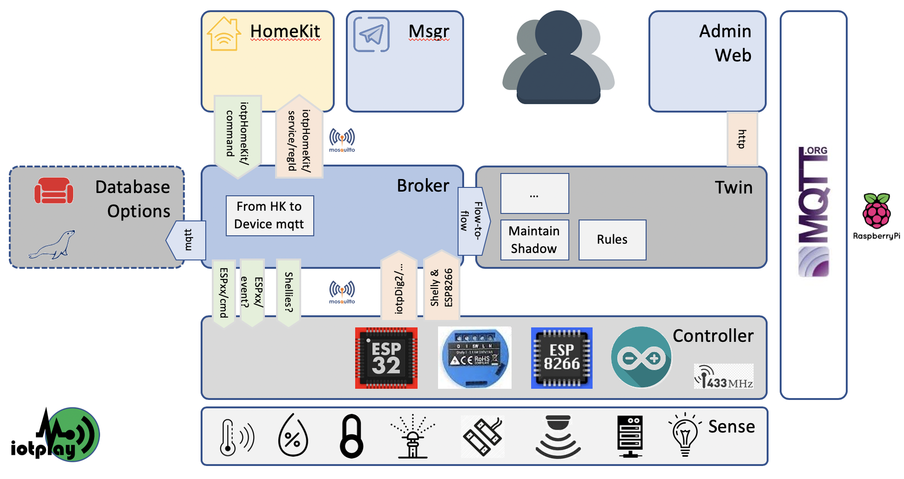

* * *
Back to [README](../README.md) at root of the Repo. 
* * *
 

# homedig2 v.0.2 - the Homie aligned version

A framework which creates a 'digital twin' representation of a home, and reduces the complexities of running the full solution. This version have been upgraded to work with the [MQTT open source Homie](https://homieiot.github.io) standard.

## A. Why, Used for what, and Inspiration

### A1. Why this Approach

Why **YAIOTF ?** (Yet another IoT Framework?). What problems did I have that I wanted to solve? What else were our options? Well, after running automation of a home for three years, which also ran on Node-RED, with ESP8266's and MQTT, with a front-end on Node-RED Dashboard, maintaining the systems became more complex. Several friends asked for systems as well. After the initial 2 yrs of having stats about our home at our fingertips, the wow-factor wore off, and only the value-adds remained. We also realised that voice commands, or a message-based interface where one can subscribe to only those messages that suites us, is useful. We also realised that to maintain an IoT system, using Node-RED, means that if you do fault-finding with different configurations will take a lot of time.

We then started looking at what was commercially available, not only for Home Automation, but since we were involved in other IoT solutions, were looking for what others did to solve similar. In the home automation space, we could have gone with pre-built apps only, like `Apple's HomeKit`, `Home Assistant`, Google Home, and others. We liked the flexibility of Node-RED, and saw that there is place to use both, own config, with for instance HomeKit. We like the Home Assistant way to configure new services, the standard of Homie for discovery. We also looked at the following:

  1. Amazon Web Services IoT Framework.  
  2. SAP's Leonardo IoT framework.
  3. Efforts by different parties to standardize, like Homie.
  4. The inner workings of MQTT, specially the retained flag.

### A2. Framework Needs

After looking at the above, specially the `Shadow` tooling and `Registry` in AWS IoT Framework, on how it used MQTT topics to delineate and keep state, we got inspired.... Broadly, our requirements list were then drawn up:

<details>
    <summary>Expand for the Needs we built the Framework on.</summary>

|#| Requirement Description |Req. Name|  
|-|-------------------------|-------------------  
|1|A framework, that created definition of the IoT devices, only in one place. |Registry |
|2|A capability where the complexity of receiving, sending, and managing the underlying IoT devices is hidden from the rest of the framework. |Broker |
|3|Standardized messaging symantics, where messages in the framework, and to other building blocks are standardised, to reduce maintenance. | The iotp message protocol |
|4| Retention of the latest-, and previous state of devices, to determine for instance durations between changes in state, thus the 'Digital Twin' of the Devices. | Twin Shadow |
|5| A rules engine, that can watch the states of devices, and take actions based on a severity of the state | Twin Rules Engine |
|6|The ability to plug in other solutions, (which can run in its own space, which will reduce maintenance), only communicating to the rest through mqtt messages, to provide new functionality, without needing to know the underlying protocols of talking to the IoT devices.  |Docker containers talking to 'The Broker'|
|7|A Plug-in to enable Apple HomeKit, where The Broker talks in the Apple HomeKit json format to it, and it talks back to the Broker - and not with the Devices  |HomeKit Node-RED Docker container|

Other solutions can now be 'plugged-in' as well, we are working on a `Messenger` container.

</details>
   

### A4. homedig2 works with setup files. What does the settings do and Why?

#### The Problem

1. We were looking for a standard way to bring IoT information to a platform, such that this standard can be used to standardise reporting, and interaction with other platforms. After building the first version of this, which my house ran for more than 7 months, I found the [MQTT open source Homie](https://homieiot.github.io) standard, "An MQTT Convention for IoT/M2M", which was exactly what I wanted. Now I did not have to think out about how to ove my standard forward, but could collaborate with others.

1. However, after trying for 6 months beginning of 2019 to convert my current fleet of devices [Shelly](https://shelly.cloud), and ESP8266's flashed with [ESPEasy](https://espeasy.readthedocs.io/en/latest/), and a few others like my alarm, etc, I realised that the move to homie standards-based messages fro mdevices are not going to convert fast. 

#### The Solution    

1. The homie standard, now at version 4, structures the messages that flows from the devices through mqtt to homie standards-based brokers. Dig2 (for digital twin) attempts to be one, not all the homie 4.0 standards have been implemented.   

1. I realised I need a mechansism to receive any form of mqtt message, and have a broker that can convert the message to a homie compliant format. Then use this message to store it in Node-RED context memory, or to go further and stick it into for instance couchDB. From here - reporting can be standardised, plus interactions with other systems, like the iotplay messager - based on Telegram and others.   


## B. Architecture & Building Blocks

See the architecture below:




### B1. Building Block functions of homedig2

<details>
    <summary>Expand for the The homedig2 function Building blocks. </summary>

```
1. Application Settings:   
   a. Registry
   b. Rules. (Severity, Action settings)
   c. Config settings

2. In-Memory Settings Lists
   a. Things Registry
   b. Things Shadow  
   c. Others

3. Broker:
   a. to dig2, from controllers (Using the `homie` protocol):
      i. Shelly
     ii. espeasy
   b. to controllers, from:
      i. HomeKit
     ii. dig2Msgr (not impl.)
   c. to HomeKit, from dig2 (Using the digsHomeKit protocol):
   d. to CoachDB, from dig2

4. Events Engine:
   a. Prime the Lists:
      i. Registry & Shadow lists
     ii. Display list
   b. Maintain in-memory lists (prune)
   c. On Event arrival:
      i. Update Shadow on Events
     ii. Update Thing events list
   d. Thing inter-Event calculations (DEPRECATED)

5. Rules Engine:
   a. Define Rules (yaml)
   b. Apply rule to event
   c. Update Shadow
   d. Make actions available to other platforms

6. Web Admin Interface:
   a. Things Registry & Controllers
   b. Things Shadow
   c. Things Status. Events, Totals  
   d. Setup.
      i. Severity Grading
     ii. Action Types
    iii. Severity Mapping Rules

7. Testbed. Trigger test events.
```
</details>


### D2. Advise for Edge Processing
To be completed. Here we add how to setup in ESPEasy & others for dig2 to work.

<details>
    <summary>Expand for the assitance on configuring ESPEasy Rules, others.</summary>

#### ESPEasy:
  - To add time to the json object, use **%unixtime%**, remember to x 1000 when the value comes in, to be a JS timestamp object.
  - For instance, to pubish to mqtt from ESP Rules:   

    ```
    Publish homedig2,{regId:"Gat-1",
                      val:{CurrentDoorState:1},
                      timestamp:%unixtime%}
    ```

#### Other?

</details>


* * *
Back to [README](../README.md) at root of the Repo. 
* * *
 