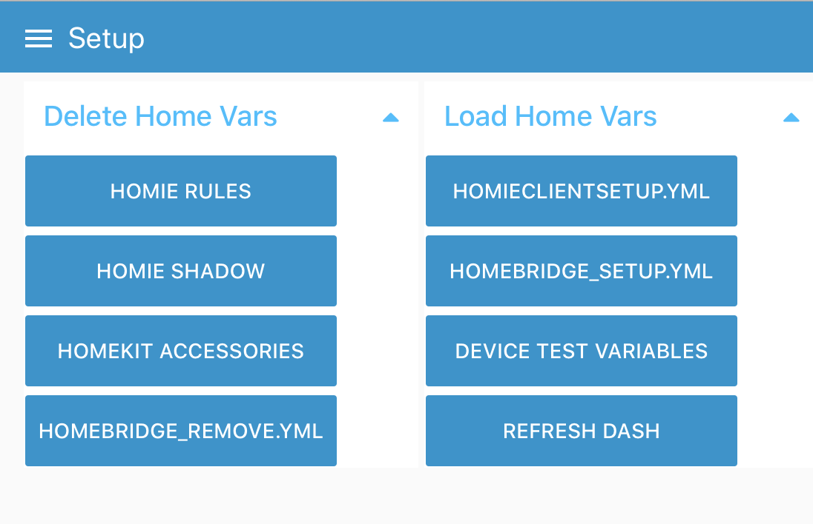

* * *
Back to [README](../README.md) at root of the Repo. 
* * *
 
# For HomeBridge : Understanding the Settings of dig2  


**About the folder structure - MyHome, and others** .   

1. This document can be viewed under the dig2 client, but also at the location: `/opt/iotplay/<3cld>_dig2/projects/Prod/Docs` where <3cld> defaults to `myh` for `my home`, but can be replaced by 3 letters which identifies the client, for cases where more than one client is hosted on the same host.    

1. In this document where the pre-letters `myh` to a folder is used, this rule applies.

1. [HomeBridge](https://homebridge.io) comes preinstalled with dig2 in this version. (We maybe latero n make it a seperately installable product, for those not on Apple). **homeBridge** requirs a seperately installed broker running on Docker, accessable by the host this is running on.

## Setting up the dig2 settings files


### Folders Locations
- `/opt/iotplay/homedig2/projects/Prod` : The folder where dig2 Node-RED flows will install, instance Production.
- `/opt/iotplay/homedig2/iotp.conf`     : The settings for the house <myh>. 

### The File names  

- Settings files for `Homie`. To assist with configuring your Home in the homie standard.
    - `homieClientSetup.yml`: For setting up your IoT devices - in cases where self-discovery standards are not complied to by the device, and even if it does, you can create etra meaning per the homie standard in this file.
    - `homieTransforms.yml`: Transforms mqtt messages from non-homie appliances to the *homie* standard.

- Settings files for `homeBridge`. 

* * * 

### The Settings Files 

#### 1. Setting up your dig2 twin with <homeBridge_Setup.yml>

A yaml file, with which to create is sent as an MQTT message into the HomeBridge docker service, which then createthe Apple HomeKit devices. The Things here must be aligned to the things created in the `dig2Homie` engine, where the MQTT standard is used, on this side, '/' is replaced with '.'. The `homedig2` engine will then be able to update the status of the `HomeBridge` created device, if the notations are followed.

Actioning the changes you made to this file, is done from the **Setup* screen, see below. 

``` yaml
---

#homebridgeSetup: # Apple Homekit
---
#Add as controller to Hombridge through MQTT queue homebridge/to/add: 

- name:             ESP62.Air.Temperature
  service_name:     Quad Temperature
  service:          TemperatureSensor
  manufacturer:     IoTPlay
  serialnumber:     ESP62.Air.Temperature

- name:             ESP72.Light.Switch
  service_name:     Outside Kitchen
  service:          Lightbulb
  manufacturer:     Sonoff
  model:            Basic
  serialnumber:     ESP72.Light.Switch
  firmwarerevision: ESP_Easy mega-20181112

- name:             shelly1-93EA75.relay.Light
  service_name:     Outside Braai
  service:          Lightbulb
  manufacturer:     Shelly
  model:            One
  serialnumber:     shelly1-93EA75.relay.Light 

- name:             Paradox.Zone.Landing_PIR
  service_name:     Landing PIR
  service:          MotionSensor
  manufacturer:     Paradox
  serialnumber:     Paradox.Zone.Landing_PIR   

- name:             ESP62.Leg1.Relay
  service_name:     Sprinkler Leg1
  service:          Valve
  manufacturer:     IoTPlay
  model:            4 sprinkler beta
  serialnumber:     ESP62.Leg1.Relay
  #ValveType:        1


- name:             ESP62.Vars.Auto
  service_name:     Sprinklers Auto
  service:          Switch
  manufacturer:     IoTPlay
  serialnumber:     ESP62.Vars.Auto
  model:            4 sprinkler beta

```


#### 2. Removing Thing objects from HomeBridge.  <homeBridge_Remove.yml> 

A yaml file, with items to be removed.

``` yaml

---
- name: ESP62.Switch.Auto

```

* * * 

## Initiating, Changing your dig2Twin

After you made changes to your setup files, the steps to get the dig2Twin to accept them. Changes are made from the Setup screen.   


   


* * *
Back to [README](../README.md) at root of the Repo. 
* * *
 